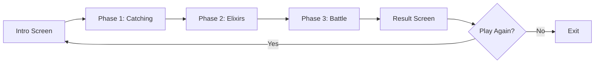

#  Pokemon Battle Arena: An AI Driven Strategy Game


##  Demo Video

<div align="left">

###  Full Gameplay Demonstration

<video width="800" controls>
  <source src="./images/pokemon_battle_arena.mp4" type="video/mp4">
 </video>

*Watch the full gameplay demonstration showing all three phases and AI battle strategies with audio!*
> - [**Download the video**](./images/pokemon_battle_arena.mp4)  OR
> - Clone the repository and open the video file directly from the `images/` folder

</div>


##  Quick Start

### Prerequisites

```bash
Python 3.8 or higher
```

### Installation

1. **Clone the repository**
```bash
git clone https://github.com/Mushfiq2007027/Pokemon-Battle-Arena-An-AI-Driven-Strategy-Game.git
cd Pokemon-Battle-Arena-An-AI-Driven-Strategy-Game
```

2. **Install dependencies**
```bash
pip install pygame numpy
```

3. **Run the game**
```bash
python main.py
```

That's it! The game will launch in fullscreen mode.

---


##  Snapshots

<div align="center">

### Intro Screen


### Phase 1: Catching Pokemon


### Phase 2: Collecting Elixirs


### Phase 3: Epic Battle


### Result Screen


</div>

---


### Game Flow



---

## 📖 Game Rules

### Phase 1: Pokemon Catching (30 seconds)
-  **Objective**: Catch 3 Pokemon using A* pathfinding
-  **Cost**: 15 fuel per catch
-  **Strategy**: AI agents navigate the grid to reach Pokemon locations
-  **Randomness**: Pokemon spawn at random locations each game

### Phase 2: Elixir Shopping (3 seconds)
-  **Budget**: 100 coins per agent
-  **Options**:
  - **Small Elixir**: Heals 25 HP, costs 15 coins
  - **Medium Elixir**: Heals 50 HP, costs 30 coins
  - **Large Elixir**: Heals 80 HP, costs 50 coins
-  **AI Strategy**: Optimal purchasing based on heal-to-cost ratio

### Phase 3: Pokemon Battle (130 seconds)
-  **Turn-Based**: Both AI agents make decisions every 0.7 seconds
-  **Actions**: Attack, Defend, Heal, or Swap Pokemon
-  **Type Advantages**: 
  - Fire > Electric (1.3x damage)
  - Electric > Water (1.3x damage)
  - Water > Fire (1.3x damage)
-  **Field Bonus**: 1.2x damage when Pokemon type matches field type
-  **Victory Conditions**:
  1. Eliminate all opponent's Pokemon, OR
  2. Have higher total HP when time expires

---

##  AI Algorithms

### 1. A* Pathfinding Algorithm

Used in **Phase 1** for optimal Pokemon catching routes.

```python
def astar(grid, start, goal):
    """
    Finds shortest path from start to goal
    - Uses Manhattan distance heuristic
    - Avoids obstacles on the grid
    - Guarantees optimal path
    """
```

**Features:**
-  Optimal path finding
-  Obstacle avoidance
-  Efficient navigation
-  Real-time pathfinding

### 2. Minimax with Alpha-Beta Pruning

Used in **Phase 3** for battle decisions.

```python
def minimax(state, depth, maximizing, alpha, beta):
    """
    Evaluates game tree to depth 3
    - Alpha-Beta pruning reduces computation
    - Evaluates: HP difference + Alive count
    - Returns optimal action: ATTACK/DEFEND/HEAL/SWAP
    """
```

**Features:**
- Looks ahead 3 moves
- Perfect information game tree
- Alpha-Beta optimization (4x faster)
- Strategic decision-making

**Evaluation Function:**
```python
score = (Ash_HP - Rocket_HP) + (Ash_Alive - Rocket_Alive) * 30
```

### 3. Fuzzy Logic Decision System

Used in **Phase 3** for healing and swapping decisions.

```python
class FuzzyLogic:
    """
    Fuzzy membership functions:
    - Low: HP < 30%
    - Medium: 30% < HP < 70%
    - High: HP > 70%
    
    Rules:
    1. IF HP is LOW AND enemy HP is HIGH THEN HEAL (0.9)
    2. IF HP is MEDIUM AND enemy HP is HIGH THEN HEAL (0.6)
    3. IF HP is LOW AND type is disadvantaged THEN SWAP (0.95)
    """
```

**Features:**
-  Human-like decision-making
-  Weighted rule system
-  Considers multiple factors
-  Smooth transitions


## Contact

If you need help or want to share feedback, feel free to reach out at mushfiq2000cpt@gmail.com


## Author

- **Md Mushfiqur Rahman (2007027)**  
  


