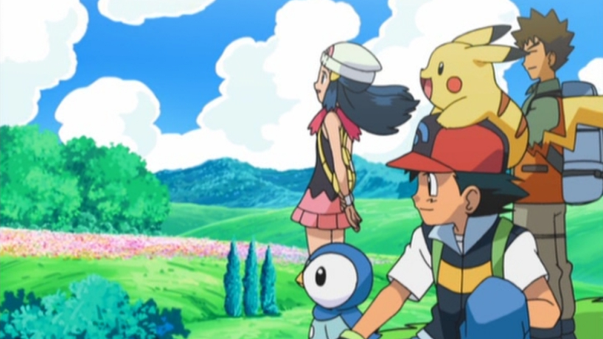
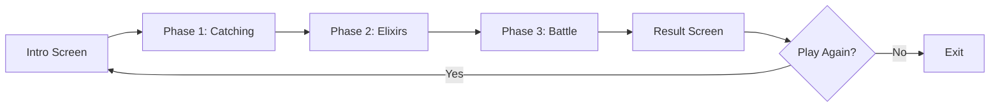

#  Pokemon Battle Arena: An AI Driven Strategy Game


##  Demo Video

<div align="center">

###  Full Gameplay Demonstration

<video width="800" controls>
  <source src="./images/pokemon_battle_arena.mp4" type="video/mp4">
 
</video>

*Watch the full gameplay demonstration showing all three phases and AI battle strategies with audio!*

> **Note for GitHub viewers**: GitHub's markdown preview may not display embedded videos. Please:
> - [**Download the video**](./images/pokemon_battle_arena.mp4) to watch with audio, OR
> - Clone the repository and open the video file directly from the `images/` folder

</div>

---

##  Features Overview

<table>
<tr>
<td width="50%">

### 🎯 Game Phases
- **Phase 1**: Pokemon Catching with A* Pathfinding
- **Phase 2**: Strategic Elixir Purchasing
- **Phase 3**: Epic Turn-Based Battle
- **Result**: Winner Celebration with Statistics

### 🤖 Advanced AI
- **Minimax Algorithm** with Alpha-Beta Pruning
- **Fuzzy Logic** for intelligent decision-making
- **A* Pathfinding** for optimal navigation
- **Strategic Evaluation** of game states

</td>
<td width="50%">

###  Visual Features
- **Dynamic Attack Animations** (200x200px icons)
- **Particle Effects** and screen shake
- **Smooth HP Animations** with color-coded bars
- **Type-Based Color System** (Fire/Water/Electric)
- **Responsive UI** that scales with window size

###  Audio Features
- **MP3 Voice Narration** for each phase
- **Sound Effects** for attacks, heals, swaps
- **Audio-Synced Timing** for seamless gameplay

</td>
</tr>
</table>

---

##  Screenshots

<div align="center">

### Intro Screen

*Game introduction with rules and controls*

### Phase 1: Catching Pokemon

*AI trainers use A* pathfinding to catch Pokemon*

### Phase 2: Collecting Elixirs

*Strategic elixir purchasing with animated collection*

### Phase 3: Epic Battle

*Turn-based Pokemon battle with stunning visual effects*

</div>

---

##  Quick Start

### Prerequisites

```bash
Python 3.8 or higher
```

### Installation

1. **Clone the repository**
```bash
git clone https://github.com/Mushfiq2007027/Pokemon-Battle-Arena-An-AI-Driven-Strategy-Game.git
cd Pokemon-Battle-Arena-An-AI-Driven-Strategy-Game
```

2. **Install dependencies**
```bash
pip install pygame numpy
```

3. **Run the game**
```bash
python main.py
```

That's it! The game will launch in fullscreen mode.

---

## 📁 Project Structure

```
pokemon-battle-arena/
│
├── 📂 images/                    # All image assets
│   ├── pokemon_intro.webp       # Intro background
│   ├── forest.jpg               # Phase 1 background
│   ├── elixir.png               # Phase 2 background
│   ├── battleground.png         # Phase 3 background
│   ├── pickachu.png             # Pokemon sprites
│   ├── charmander.png
│   ├── squirtle.png
│   ├── meowth.png
│   ├── weezing.png
│   ├── wobbuffet.png
│   ├── ash.png                  # Trainer sprites
│   ├── team_rocket.png
│   ├── fire_right.png           # Attack effect icons
│   ├── fire_left.png
│   ├── water_right.png
│   ├── water_left.png
│   ├── electric_right.png
│   ├── electric_left.png
│   └── pokemon_battle_arena.mp4 # Demo video
│
├── 📂 sound/                     # All audio files
│   ├── game_intro_voice.mp3
│   ├── phase_1.mp3
│   ├── phase_2.mp3
│   ├── phase_3.mp3
│   ├── game_result_ash_wins.mp3
│   ├── game_result_team_rocket_wins.mp3
│   └── game_result_match_tied.mp3
│
├── 📄 config.py                  # Configuration constants
├── 📄 models.py                  # Data models
├── 📄 utils.py                   # Utility functions
│
├── 🤖 ash_ai_agent.py           # Ash's AI logic
├── 🤖 team_rocket_ai_agent.py   # Team Rocket's AI logic
│
├── 🎮 game_intro.py             # Intro screen module
├── 🎮 phase_1.py                # Catching phase module
├── 🎮 phase_2.py                # Elixir phase module
├── 🎮 phase_3.py                # Battle phase module
├── 🎮 game_result.py            # Result screen module
│
├── ▶️ main.py                    # Main entry point
└── 📖 README.md                  # This file
```

---

## 🎮 How to Play

### Controls

| Key | Action |
|-----|--------|
| `P` | Pause game |
| `R` | Resume game |
| `E` | Exit game |
| `A` | Play again (after game over) |
| `ESC` | Quick exit |

### Game Flow



---

## 📖 Game Rules

### Phase 1: Pokemon Catching (30 seconds)
-  **Objective**: Catch 3 Pokemon using A* pathfinding
-  **Cost**: 15 fuel per catch
-  **Strategy**: AI agents navigate the grid to reach Pokemon locations
-  **Randomness**: Pokemon spawn at random locations each game

### Phase 2: Elixir Shopping (3 seconds)
-  **Budget**: 100 coins per agent
-  **Options**:
  - **Small Elixir**: Heals 25 HP, costs 15 coins
  - **Medium Elixir**: Heals 50 HP, costs 30 coins
  - **Large Elixir**: Heals 80 HP, costs 50 coins
-  **AI Strategy**: Optimal purchasing based on heal-to-cost ratio

### Phase 3: Pokemon Battle (130 seconds)
-  **Turn-Based**: Both AI agents make decisions every 0.7 seconds
-  **Actions**: Attack, Defend, Heal, or Swap Pokemon
-  **Type Advantages**: 
  - Fire > Electric (1.3x damage)
  - Electric > Water (1.3x damage)
  - Water > Fire (1.3x damage)
-  **Field Bonus**: 1.2x damage when Pokemon type matches field type
-  **Victory Conditions**:
  1. Eliminate all opponent's Pokemon, OR
  2. Have higher total HP when time expires

---

##  AI Algorithms

### 1. A* Pathfinding Algorithm

Used in **Phase 1** for optimal Pokemon catching routes.

```python
def astar(grid, start, goal):
    """
    Finds shortest path from start to goal
    - Uses Manhattan distance heuristic
    - Avoids obstacles on the grid
    - Guarantees optimal path
    """
```

**Features:**
- ✅ Optimal path finding
- ✅ Obstacle avoidance
- ✅ Efficient navigation
- ✅ Real-time pathfinding

### 2. Minimax with Alpha-Beta Pruning

Used in **Phase 3** for battle decisions.

```python
def minimax(state, depth, maximizing, alpha, beta):
    """
    Evaluates game tree to depth 3
    - Alpha-Beta pruning reduces computation
    - Evaluates: HP difference + Alive count
    - Returns optimal action: ATTACK/DEFEND/HEAL/SWAP
    """
```

**Features:**
- ✅ Looks ahead 3 moves
- ✅ Perfect information game tree
- ✅ Alpha-Beta optimization (4x faster)
- ✅ Strategic decision-making

**Evaluation Function:**
```python
score = (Ash_HP - Rocket_HP) + (Ash_Alive - Rocket_Alive) * 30
```

### 3. Fuzzy Logic Decision System

Used in **Phase 3** for healing and swapping decisions.

```python
class FuzzyLogic:
    """
    Fuzzy membership functions:
    - Low: HP < 30%
    - Medium: 30% < HP < 70%
    - High: HP > 70%
    
    Rules:
    1. IF HP is LOW AND enemy HP is HIGH THEN HEAL (0.9)
    2. IF HP is MEDIUM AND enemy HP is HIGH THEN HEAL (0.6)
    3. IF HP is LOW AND type is disadvantaged THEN SWAP (0.95)
    """
```

**Features:**
- ✅ Human-like decision-making
- ✅ Weighted rule system
- ✅ Considers multiple factors
- ✅ Smooth transitions

---

##  Technical Highlights

### Architecture

**Modular Design**: Code split into 11 focused modules for maintainability

```
Core Layer (3 files)
├── config.py     → Constants & settings
├── models.py     → Data structures
└── utils.py      → Shared utilities

AI Layer (2 files)
├── ash_ai_agent.py          → Ash's AI
└── team_rocket_ai_agent.py  → Team Rocket's AI

Game Layer (5 files)
├── game_intro.py    → Intro screen
├── phase_1.py       → Catching phase
├── phase_2.py       → Elixir phase
├── phase_3.py       → Battle phase
└── game_result.py   → Result screen

Main Layer (1 file)
└── main.py          → Game coordinator
```

### Performance

| Metric | Value |
|--------|-------|
| FPS | 60 (locked) |
| AI Decision Time | ~0.7 seconds |
| Minimax Depth | 3 levels |
| Node Exploration | ~100-300 nodes/turn |
| Memory Usage | ~150 MB |
| Python Version | 3.8+ |

### Scalability Features

- ✅ **Responsive UI**: Scales to any window size
- ✅ **Resizable Window**: Drag to resize, UI adapts
- ✅ **Dynamic Asset Loading**: Images scaled on-demand
- ✅ **Efficient Rendering**: Only draws visible elements
- ✅ **Audio Management**: 16 channel mixer for overlapping sounds

---

## 🎓 Educational Value

This project demonstrates:

### Algorithms
- **A* Pathfinding**: Optimal navigation in grid-based environments
- **Minimax Algorithm**: Game theory for turn-based games
- **Alpha-Beta Pruning**: Optimization technique for game trees
- **Fuzzy Logic**: Rule-based decision systems

### Software Engineering
- **Modular Design**: Separation of concerns
- **Object-Oriented Programming**: Classes and data structures
- **State Machines**: Game state management
- **Event-Driven Architecture**: Input handling and game loop

### Game Development
- **Sprite Animation**: Pokemon bobbing and attack effects
- **Particle Systems**: Visual effects for attacks and heals
- **Audio Synchronization**: Voice narration timing
- **UI/UX Design**: Clean interface without clutter

---

##  Configuration

### Modify Game Settings

Edit `config.py` to customize:

```python
# Phase Timings
INTRO_TIME = 7.0      # Intro duration
PHASE1_TIME = 30.0    # Catching duration
PHASE2_TIME = 3.0     # Elixir shopping duration
PHASE3_TIME = 130.0   # Battle duration

# Type System
TYPEADV = {
    ("Fire", "Electric"): 1.3,
    ("Electric", "Water"): 1.3,
    ("Water", "Fire"): 1.3
}
FIELDBOOST = 1.2

# Economy
FUELPERCATCH = 15
STARTFUEL = 45
COINSPERAGENT = 100
```

### Add New Pokemon

1. Add sprite to `images/` folder
2. Update `ASHTEAMSPECIES` or `ROCKETTEAMSPECIES` in `config.py`
3. Add image path to `IMAGEASSETS` dictionary

```python
ASHTEAMSPECIES = [
    ("Pikachu", "Electric"),
    ("Charmander", "Fire"),
    ("Squirtle", "Water"),
    ("YourPokemon", "YourType")  # Add here
]
```

---

##  Troubleshooting

### Common Issues

**Problem**: "No module named 'pygame'"
```bash
Solution: pip install pygame
```

**Problem**: Missing audio files
```
Solution: Game will continue without voice narration
Check that .mp3 files are in sound/ folder
```

**Problem**: Missing image files
```
Solution: Game will show colored placeholders
Check that image files are in images/ folder
```

**Problem**: Low FPS or lag
```
Solution: 
- Close other applications
- Reduce window size
- Update graphics drivers
```

**Problem**: No sound
```
Solution:
- Check system volume
- Verify .mp3 files exist in sound/ folder
- Update pygame: pip install --upgrade pygame
```

---

##  Battle Mechanics Deep Dive

### Damage Calculation

```python
def compute_damage(attacker, defender, field_type):
    base_damage = max(5, attacker.atk - defender.dfn // 2)
    multiplier = 1.0
    
    # Type advantage
    if (attacker.type, defender.type) in TYPE_ADV:
        multiplier *= 1.3
    
    # Field bonus
    if attacker.type == field_type:
        multiplier *= 1.2
    
    # Randomness
    multiplier *= random.uniform(0.8, 1.2)
    
    return int(base_damage * multiplier)
```

### AI Action Selection

Each turn, both AI agents:

1. **Evaluate Legal Actions**
   - Always: ATTACK, DEFEND
   - Conditional: SWAP (if type advantage available)
   - Conditional: HEAL (if elixir available and HP low)

2. **Minimax Tree Search**
   - Explore game tree 3 levels deep
   - Evaluate ~100-300 game states
   - Use Alpha-Beta pruning to skip irrelevant branches

3. **Select Best Action**
   - Returns action with highest evaluation score
   - Breaks ties randomly for unpredictability

### Turn Execution

```
Each 0.7 seconds:
├── AI 1 decides action
├── AI 2 decides action
├── Apply SWAP/HEAL actions first
├── Process DEFEND flags
├── Execute ATTACK actions simultaneously
├── Check for fainted Pokemon
└── Auto-swap to next alive Pokemon
```


##  License

This project is for **educational purposes**. Pokemon and related characters are property of Nintendo/Game Freak.

## Project Members
  (1) Md Mushfiqur Rahman (2007027)
  (2) M Rahimeen Fatin (2007029)


